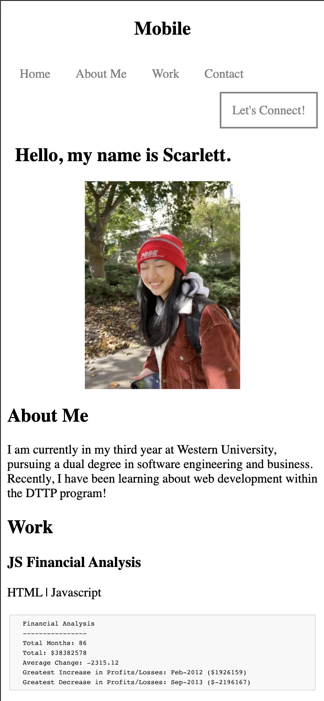
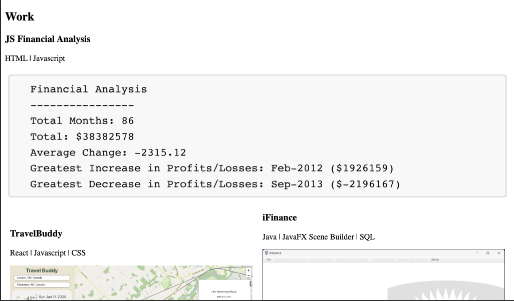

# dttp-wdp-portfolio
This is a repository that acts as a portfolio for the Diverse Tech Talent Program, Web Development Program.
As the course progresses, the demonstrative exercises will be added as links off the portfolio page.

The site is live at https://swu664.github.io/dttp-wdp-portfolio/.

For the portfolio-rebuild, flexbox, media queries, and CSS variables will be the learnings applied.
    When the page is loaded, the page presents your name, a recent photo or avatar, and
    links to sections about you, your work, and how to contact you.
    When one of the links in the navigation is clicked then the UI scrolls to the corresponding section.
    When viewing the section about your work, then the section contains titled images of your applications.
    When presented with the your first application then that application's image should be larger in size than the others.
    When images of the applications are clicked then the user is taken to that deployed application.
    When the page is resized or viewed on various screens and devices then the layout is responsive and adapts to my viewport.

    
    